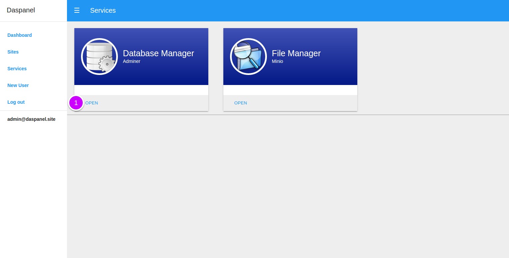
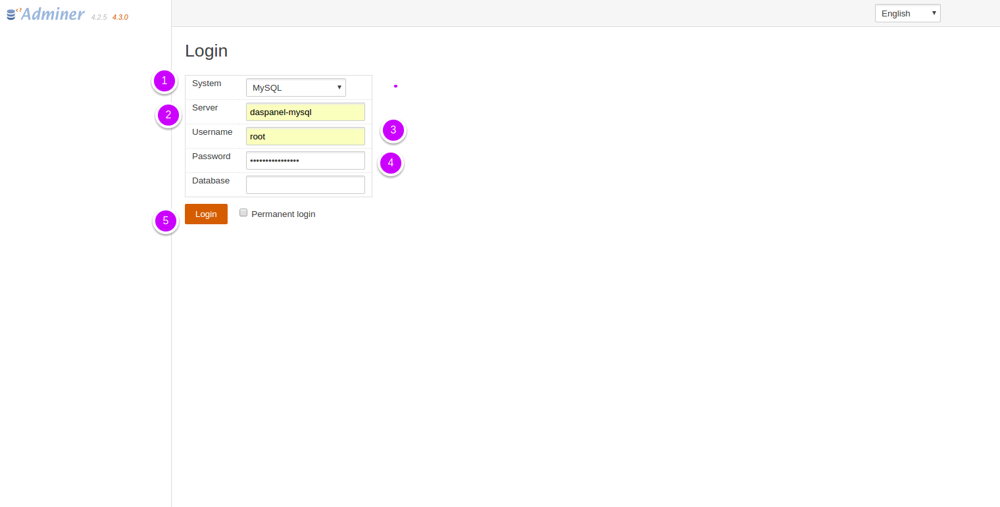
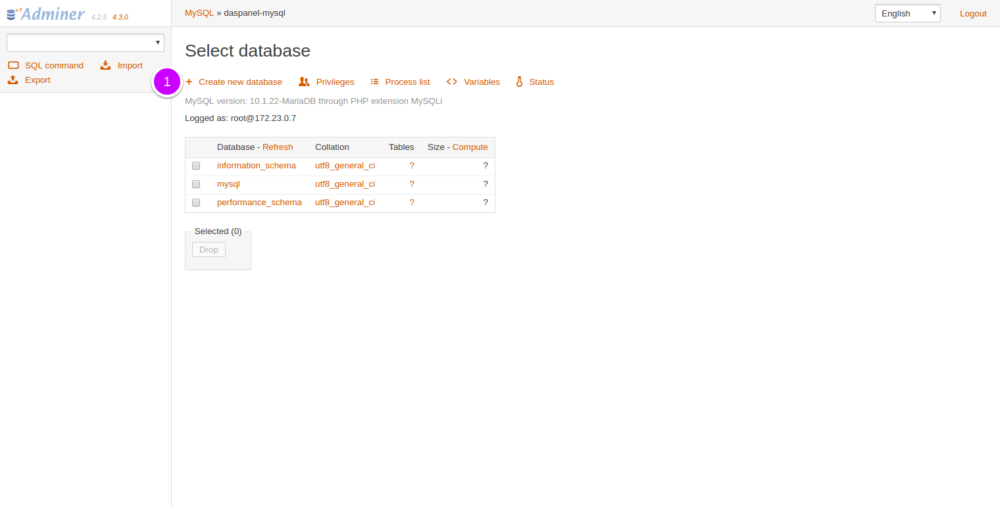
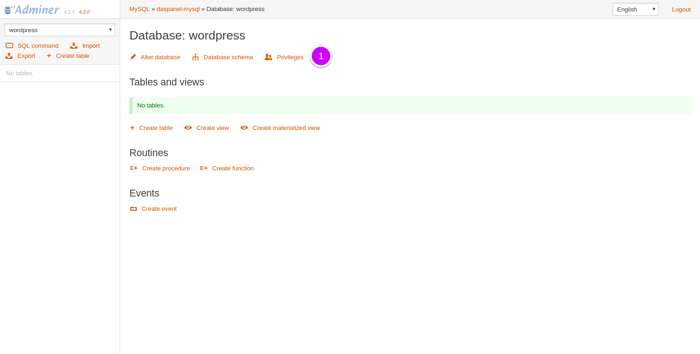
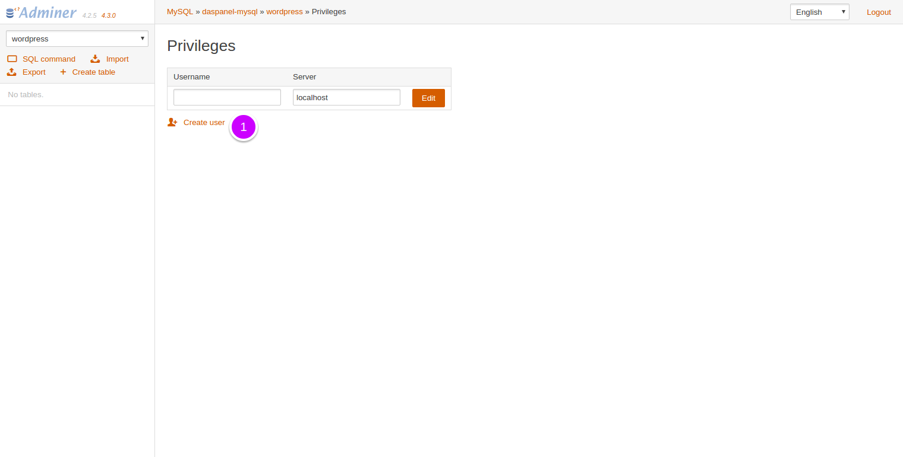
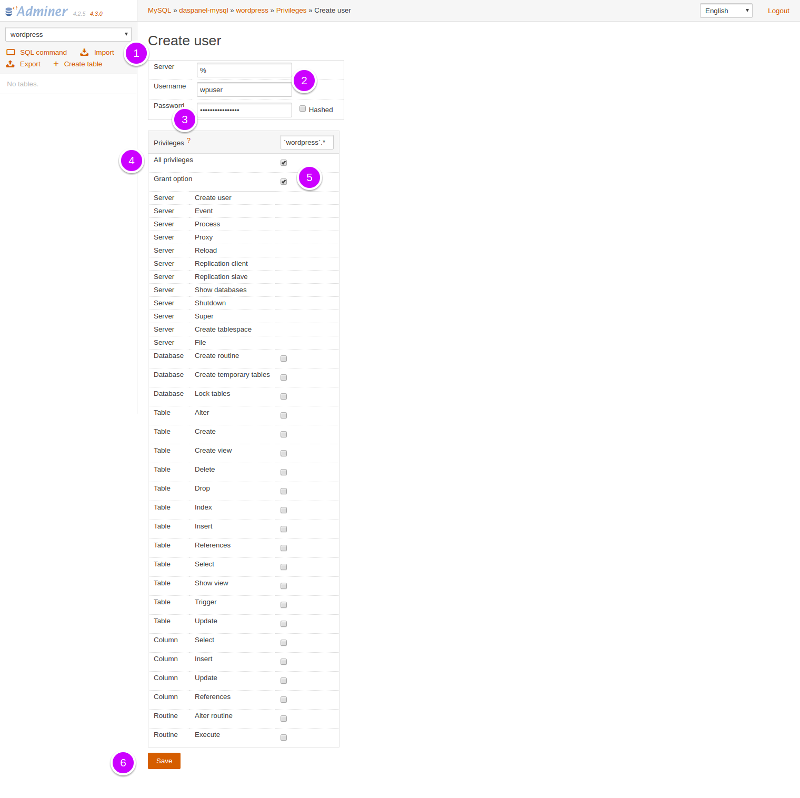

# Database manager

One of the services offered by Daspanel is the database manager. For this service 
the chosen tool is the <b><a href="https://www.adminer.org/" target="_blank">Adminer</a></b>.
We chose it because in addition to MySql it works with a number of other types of databases.

!!! note ""
    Daspanel comes with a container running a MySql database server, more 
    specifically the <a href="https://mariadb.org/" target="_blank">MariaDB 10</a>.
    It can be used for the local development of sites and also in the public hosting of them.

## Accessing it
In the control panel click the services menu

On the next screen where all avaiable services are listed.

1. Click this buttom to open the database manager service.

!!! tip ""
    You can directly access the database manager by opening the url 
    <b><a href="http://adminer.svc.daspanel.site" target="_blank">adminer.svc.daspanel.site</a></b>
    in your browser.

A new window will open in your browser to enter the login data on the database server. 
In the example below we will show you how to log in to the Daspanel MySql server, 
for other servers that you want to use, just use the appropriate credentials.

1. **System**: Select "MySQL"
2. **Server**: Enter "daspanel-mysql" as the server address. If you are going to use an external server, please enter its valid address here.
3. **Username**: Enter "root"
4. **Password**: Inform the admin password.
5. Click the login button.

!!! tip "Admin password"
    You can easily obtain login credentials in the *** Database Management *** section of 
    the Daspanel `System->Services Users` module using the link below:
    

        <b><a href="https://admin.daspanel.site/system/services/users" target="_blank">admin.daspanel.site/system/services/users</a></b> 
    

## Create database

Let's say we want to create a database for Wordpress. Being in the Adminer main screen:

On the next page

1. Enter the database name
2. Select collation type, the recommended one is **utf8_general_ci**
3. Click the Save button to create the database

## Create database user

On the page that displays database details

1. **Privileges**: Click this link

On the next page you can associate existing users with the database or create a 
new user and associate it with the database.

1. **Create user**: Click this link to add new database user

On the next page we will add our new user:

1. **Server**: Put % here.
2. **Username**: Choose the login username
3. **Password**: Choose a good password and put here
4. **All privileges**: Mark this oiption
5. **Grant option**: Mark it to allow the user add anothers users
6. Click the save button to create the new user

!!! warning "Security"
    1. The Daspanel MySQL container can only be accessed by the other docker containers 
    that are on your internal network created by `docker-compose`, so it is not 
    so dangerous to use **%** in the host field.
    2. To simplify the example we created a user with all the powers in relation to the database 
    to which he was associated, of course you can opt in a more rigid control of the granted permissions.

