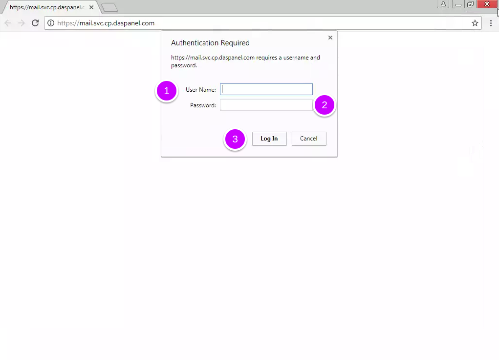
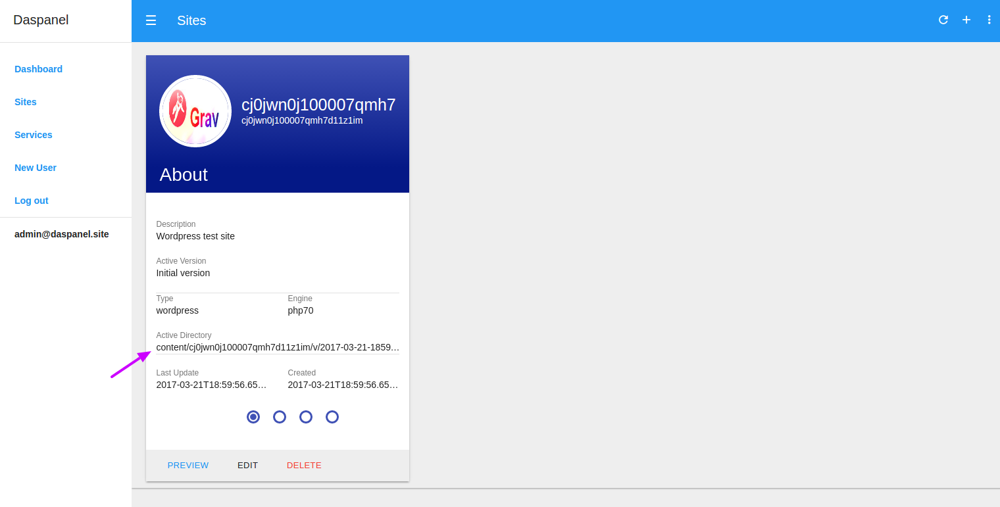

# File Manager

Every hosting control panel needs a way to manage their files and minimally do some 
file operations like upload, download, delete, edit, etc. We choose not to use FTP but use a 
more modern way of doing this. The solution we chose is a tool that can be used 
through the browser.

For this service the chosen tool is the <b><a href="https://github.com/servocoder/RichFilemanager" target="_blank">RichFilemanager</a></b>.

## Accessing it

In the control panel click the services menu

[](/img/services-menu.png)

On the next screen where all avaiable services are listed.

[](img/open-file-manager.png)

1. Click this buttom to open the file manager service.

!!! tip ""
    You can directly access the file manager by opening the url 
    <b><a href="http://fm.svc.daspanel.site" target="_blank">fm.svc.daspanel.site</a></b>
    in your browser.

If this is the first time you access the file manager in the current session of 
your browser, a screen like this will appear to log in:

[](img/mailcatcher-login.png)

1. **User Name**: Is the file manager user.
2. **Password**: Is the file manager user passord.

3. Click the login in button.

!!! tip "Login credentials"
    You can easily obtain login credentials in the *** File Manager *** section of 
    the Daspanel startup notification message using the link below:
    <p align="center">
        <b><a href="http://mail.svc.daspanel.site" target="_blank">mail.svc.daspanel.site</a></b><br>
    </p>

After your browser has an authentication token with file manager access 
permission, the initial page of the file manager will be displayed:

## Where are the files of a website?

Each site you create has a unique universal ID, as well as each version of it. 
For each site there is at least one version. And each site has its active version, 
the version that will be displayed by default when accessing it.

To find out where the active files of the site are, just look at the screen below 
the field **Active Directory**:

[](img/filemanager-sitedir.png)

After you have logged into the file manager go to the location of the site files 
and make the modifications you want.

So, if the **Active Directory** of your site is: 
``` shell
content/cjazrj324000064o30n24o9ev/v/cjazrj324000164o34o3b7wlu
```


Then you need to go in the file manager to this location:

[](img/filemanager-site.png)

1. This is the directory where all the sites of your Daspanel instance are located.
2. Is the UUID (directory) of the site
3. Is the UUID (directory) of the version you are editing

And every arrow points to context menus avaiable to do file manager operations.


