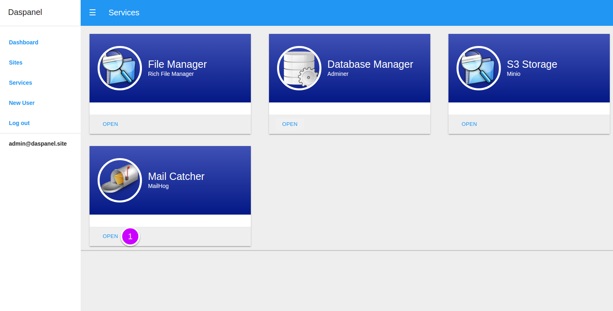
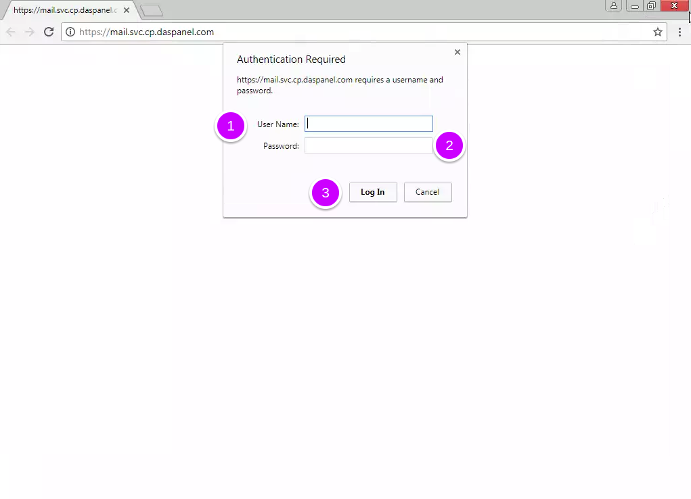
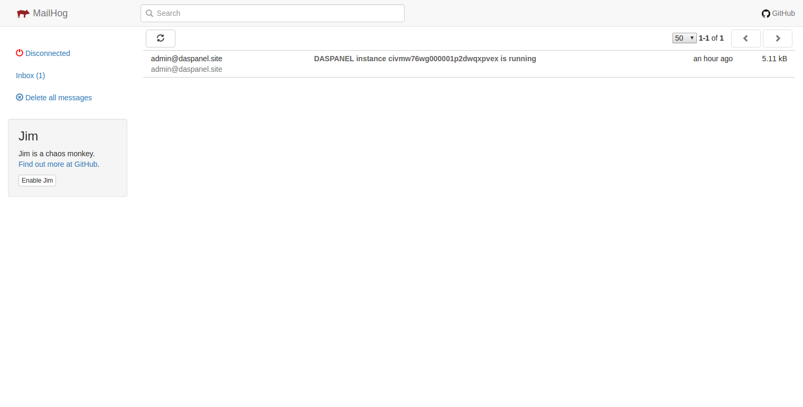
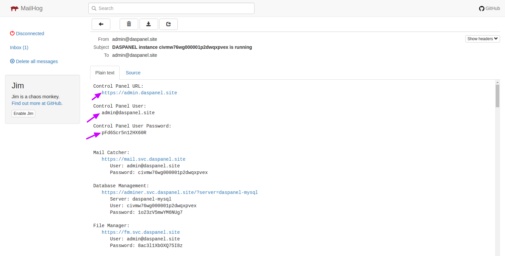

# Mail Catcher

As a design option Daspanel does not come with an outgoing mail (SMTP) server 
service. We made this choice because of the complexity of maintaining and 
managing a service of this type that is far beyond the responsibilities of a 
site developer.

If the site you are hosting at Daspanel needs to send emails to the world we 
recommend that you use a professional external service such as 
<b><a href="https://www.mailgun.com/" target="_blank">Mailgun</a></b> that 
offers a free sending limit of 10,000 emails / month. You can also use your 
email account provider, such as Gmail for example.

However, if your site attempts to send an email without using an external 
service, using the PHP mail () command for example, the message will be 
captured by Daspanel using the Mail Catcher service and will not be sent to the 
recipient, no matter what email address you use.

This is useful for:

* Test the sending of emails during the development of the site.
* Discover site modules that try to send email without using an external service.
* Receive Daspanel notifications without the need to set up an external e-mail 
sending account.

For this service the chosen tool is the <b><a href="https://github.com/mailhog/MailHog" target="_blank">MailHog</a></b>.

## Accessing it

In the control panel click the services menu

On the next screen where all avaiable services are listed.

1. Click this buttom to open the mail catcher service.

!!! tip ""
    You can directly access the Mail Catcher by opening the url 
    <b><a href="https://mail.svc.daspanel.site" target="_blank">mail.svc.daspanel.site</a></b>
    in your browser.

!!! warning ""
    If you modified the `DASPANEL_SYS_HOST` to an address other than `daspanel.site`, 
    `mydomain.com` for example, the control panel URL will be 
    https://mail.svc.mydomain.com

A new window will open in your browser to enter the login data on the mail catcher. 

## Mail catcher login

1. **User Name**: Is the admin email
2. **Password**: Is the UUID of your Daspanel.
3. Click the login in button.

!!! tip "Login credentials"
    * If you have not configured the *DASPANEL_SYS_ADMIN* variable in the 
    daspanel.env file the admin email is admin@daspanel.site.
    * Or, if you have set the *DASPANEL_SYS_HOSTNAME* but not the *DASPANEL_SYS_ADMIN* it will be '*admin*' + '@' + the value of *DASPANEL_SYS_HOSTNAME*.
    * The UUID is the value of variable *DASPANEL_SYS_UUID* in the same file.

## Mail catcher interface

After logging into the mail catcher you will see a standard webmail interface, 
as below:

!!! warning ""
    Every email sent by your sites that does not use an external SMTP server, or any 
    DASPANEL notification will be here. **IMPORTANT:** these messages are stored in 
    memory, when the containers stop they disappear.

### Instance info email

Click on the most recent message with the subject `DASPANEL instance c...` and in it 
you will find all the necessary information about how to access the various 
control panel services:

