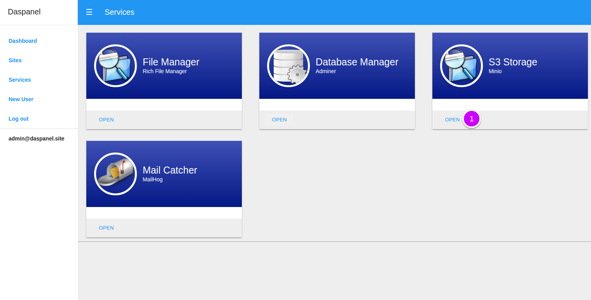
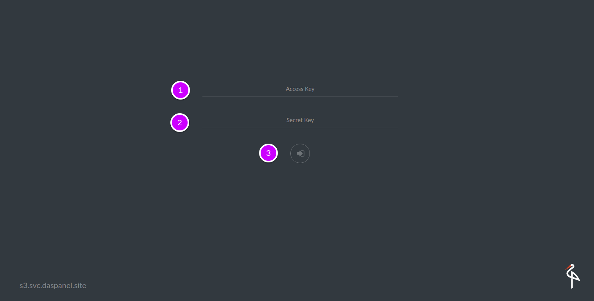
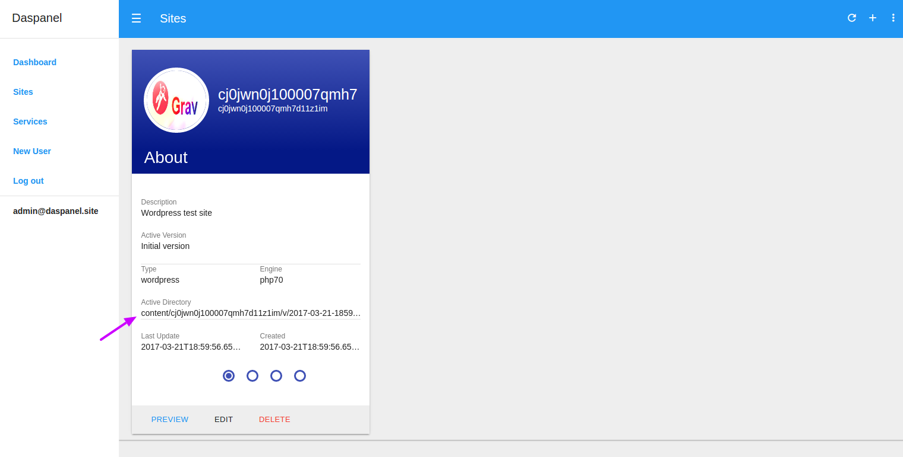
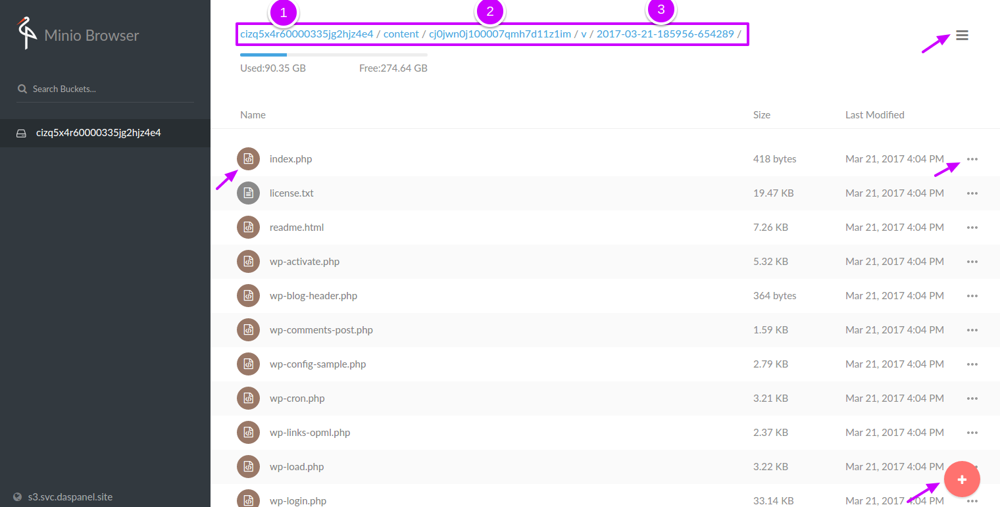

# S3 Storage

Every hosting control panel needs a way to manage their files and minimally do some 
file operations like upload, download, delete, etc. We choose not to use FTP but use a 
more modern solution that is a de facto industry standard. The solution we chose 
was to use the S3 protocol that was created by Amazon and became a standard. 
It is secure, stable, standardized and with numerous tools available to access it.

For this service the chosen tool is the <b><a href="https://minio.io/" target="_blank">Minio</a></b>.

## Accessing it

In the control panel click the services menu

On the next screen where all avaiable services are listed.

1. Click this buttom to open the file manager service.

!!! tip ""
    You can directly access the file manager by opening the url 
    <b><a href="http://s3.svc.daspanel.site" target="_blank">s3.svc.daspanel.site</a></b>
    in your browser.

A new window will open in your browser to enter the login data on the file manager. 

1. **Access Key**: First 20 characters of the UUID of your Daspanel
2. **Secrect key**: Is the same password of the Daspanel admin.
3. Click the login button.

!!! tip "Login credentials"
    You can easily obtain login credentials in the *** S3 CONFIG *** section of 
    the Daspanel startup notification message using the link below:
    

        <b><a href="http://mail.svc.daspanel.site" target="_blank">mail.svc.daspanel.site</a></b> 
    

## Where are the files of a website?

Each site you create has a unique universal ID, as well as each version of it. 
For each site there is at least one version. And each site has its active version, 
the version that will be displayed by default when accessing it.

To find out where the active files of the site are, just look at the screen below 
the field **Active Directory**:

After you have logged into the file manager go to the location of the site files 
and make the modifications you want.

Where:

1. Is the UUID of the bucket holding all files of your Daspanel installation
2. Is the UUID of the site
3. Is the version you are editing

And every arrow points to context menus avaiable to do file manager operations.

