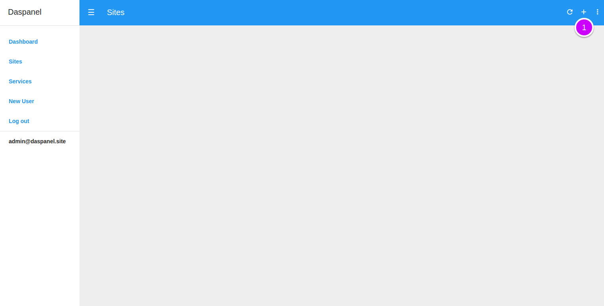
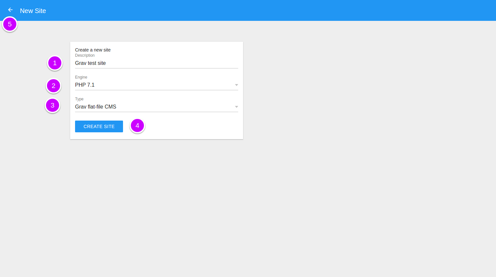
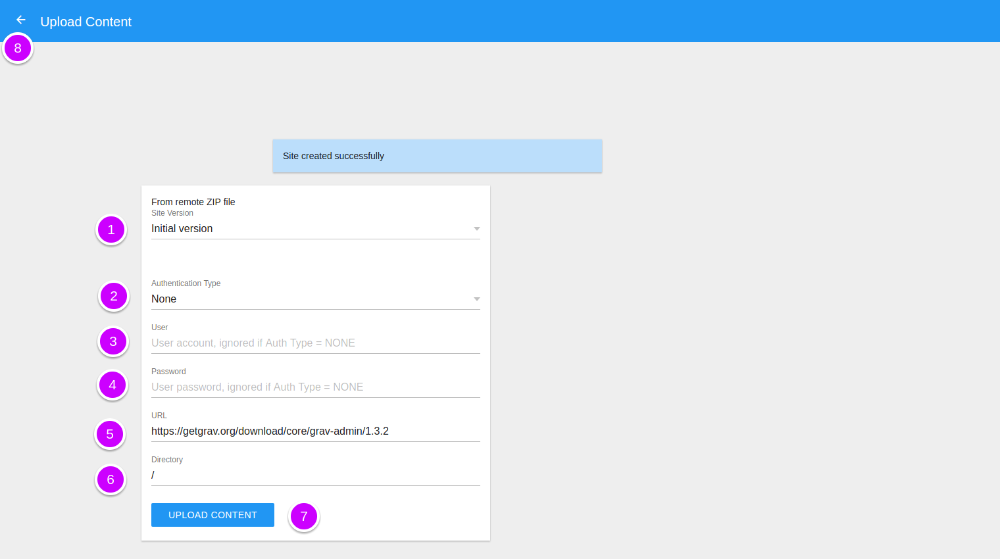
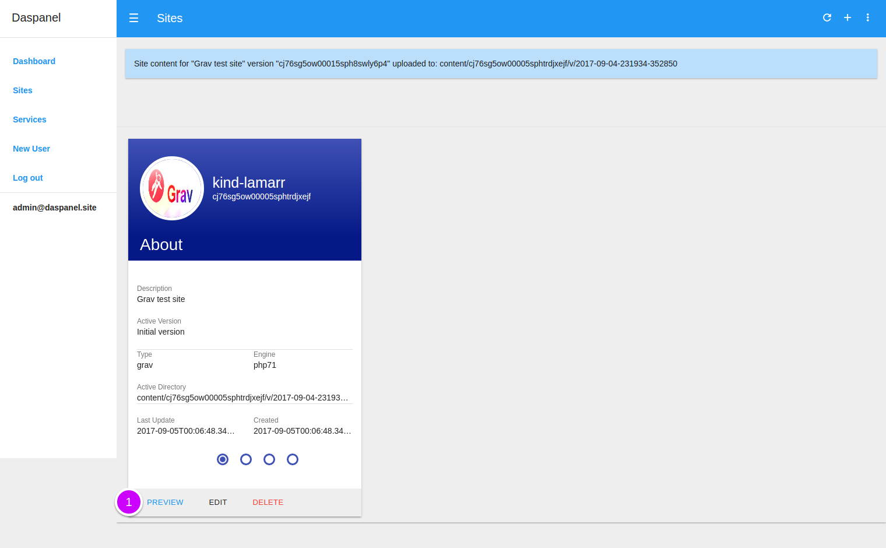

# Add Site

Go to the [Sites module](http://admin.daspanel.site/sites/)

1. Click the "**+**" button at the top right of the sites page.

You'll see a new page to add the site:

1. **Description**: Write an description for the site
2. **Engine**: Select the type of engine that will be used by the site

    !!! note ""
        The engine of the website is nothing more than the programming language 
        that is used to create it. If your site needs PHP choose the engine with 
        the most appropriate version. If the site is made only with HTML and 
        Javascript choose the option *Static*.

3. **Type**: Select the type of the site

    !!! note ""
        The options of this choice vary depending on the engine chosen for the 
        site in the previous option. All engines will have at least the 
        *Generic* option.

        If the engine of your site is not *Static* it is important to choose the 
        correct type because it is through this information that Daspanel will 
        properly configure the HTTP server for the site being created.

4. Create the new site by clicking the **CREATE SITE** button.
5. Or click the **left arrow**  at the top of 
the screen to return without saving anything.

When you create a new site, Daspanel automatically notifies the Docker container 
responsible for the chosen engine and the load balancer so that they update 
with the configurations of the created site.

Once the site is added, you can install a first content on it using the 
following page that is displayed shortly afterwards - **this step is optional**:

1. **Site Version**: Because the site is new the only possible option is the 
*Initial Version*
2. **Authenticacion Type**: Ignored for now. It will be used in the future.
3. **User**: Ignored for now. It will be used in the future.
4. **Password**: Ignored for now. It will be used in the future.
5. **Url**: The link to a ZIP file available for download from the internet.
6. **Directory**: Ignored for now. It will be used in the future.
4. Install the content that is in the *Url* address to the new site by clicking 
the **UPLOAD CONTENT** button.
5. Or click the **left arrow**  at the top of 
the screen to return without install any content on the newly create site.

After all, you'll see the this page with the list of sites on your Daspanel:

1. Click the "**PREVIEW**" button to see the site you created.

