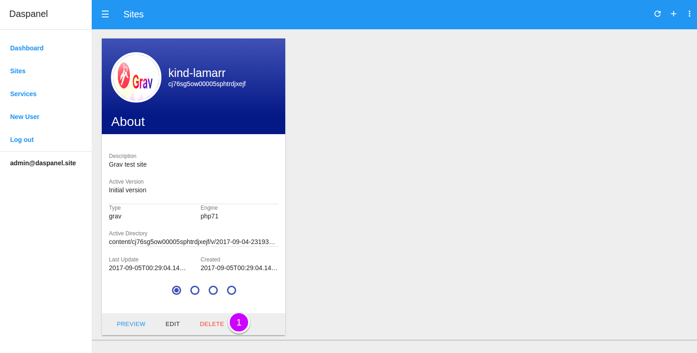
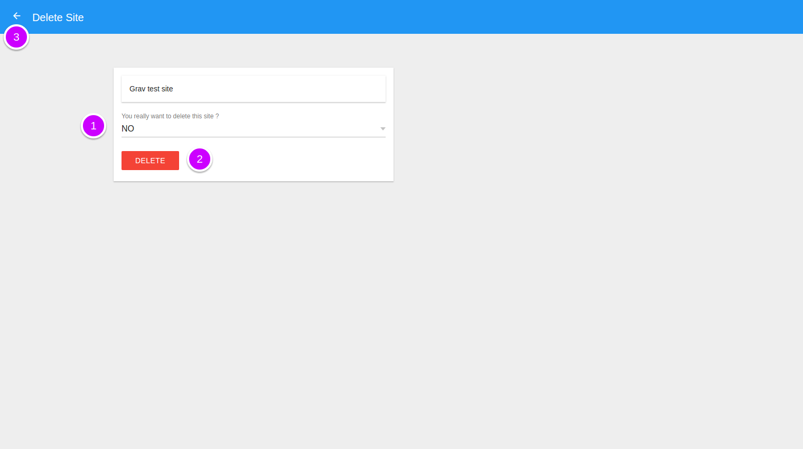

# Delete Site

Go to the [Sites module](http://admin.daspanel.site/sites/)

1. Click the "DELETE" button of the site you want delete.

You'll see a new page to delete the site:

1. **You really want to delete this site ?**: Choose YES to confirm that the 
site can be deleted.
2. Delete the site by clicking the "**DELETE**" button.

    !!! danger ""
        This command has no return. When you confirm deletion of a site all of 
        its data in Daspanel will be deleted forever. No possibility of recovery.

3. Or click the **left arrow**  at the top of 
the screen to return without delete anything.

When you delete a site, Daspanel automatically notifies the HTTP server and 
Load Balancer containers to update with the new information.
