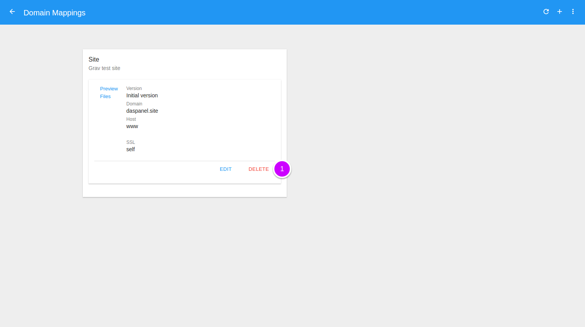
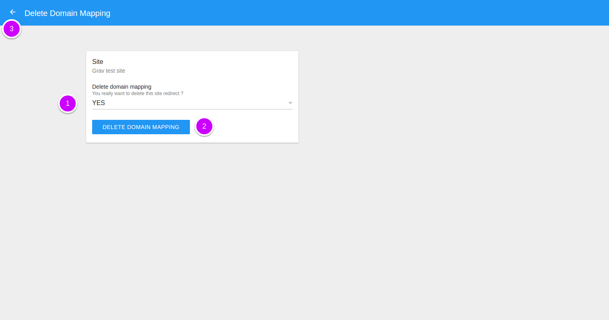
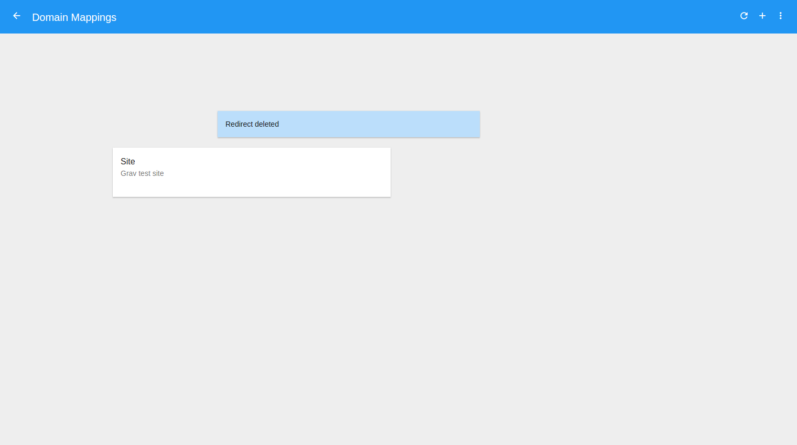

# Delete Domain Mapping

To see the available domain mappings of a site go to the [Sites module](http://admin.daspanel.site/sites/)

1. Click the **fourth bullet** to display the domain mapping management area of 
the chosen site.

The site card will be changed to the domain mapping management management area:

1. Click the **MANAGE** buttom to go the management page.

On the next page you will see a list of all the existing domain mappings for the site:

1. Click the "**DELETE**" button.

You will see a new page to confirm deletion of the mapping.

1. **You really want to delete this domain mapping ?**: Choose YES to confirm that the 
mapping can be deleted.
2. Delete the mapping by clicking the "**DELETE DOMAIN MAPPING**" button.

    !!! danger ""
        This command has no return. When you confirm deletion of a domain 
        mapping all of its data in Daspanel will be deleted forever. 
        No possibility of recovery.

3. Or click the **left arrow**  at the top of 
the screen to return without deleting anything.

Once the operation is successfully completed the list of domain mappings is updated:

