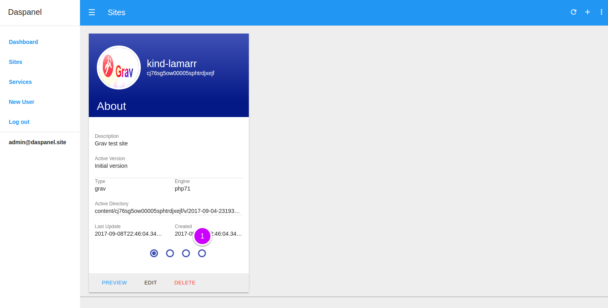
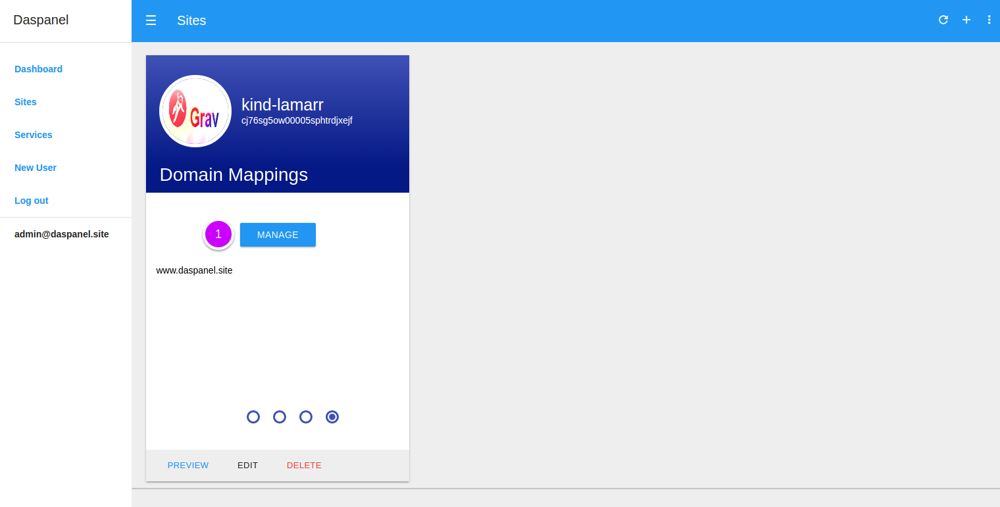
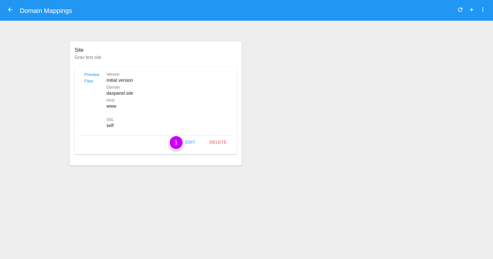
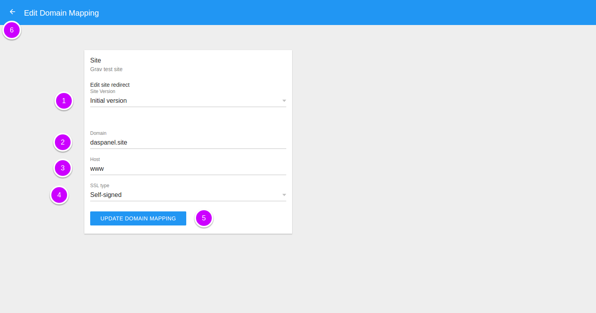
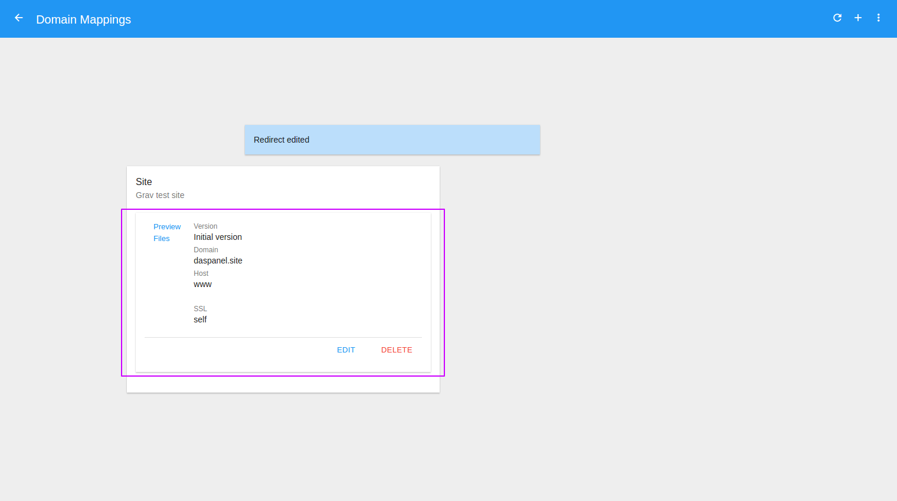

# Edit Domain Mapping

To see the available domain mappings of a site go to the [Sites module](http://admin.daspanel.site/sites/)

1. Click the **fourth bullet** to display the domain mapping management area of 
the chosen site.

The site card will be changed to the domain mapping management management area:

1. Click the **MANAGE** buttom to go the management page.

On the next page you will see a list of all the existing domain mappings for the site:

1. Click the "**EDIT**" button.

You'll see a new page to edit the domain mapping for the site:

1. **Site Version**: Select the version where to map the domain address.
2. **Domain**: domain name.
3. **Host**: It is the host or prefix that will be used with the domain to 
create the URL to access the site. For example: www.

    !!! tip "if you use `www` as host"
        When you put `www` here Daspanel will automatically also 
        map **domain** to the same site.

4. **SSL Type**: Select the type of SSL certificate to be used with this address

    !!! warning ""
        Valid SSL certificates can only be obtained for valid domains and with 
        Daspanel running on a public IP address available on the internet. SSL 
        certificates can not be obtained for the domain `daspanel.site` because any 
        address associated with it will always have as IP address **127.0.0.1**.
        
        If you are running Daspanel locally, ie accessing it using the 
        `daspanel.site` domain, the SSL certificates will always be of the self 
        signed type, regardless of the type selected for the domain mapping.

5. Edit the domain mapping by clicking the **UPDATE DOMAIN MAPPING** button.
6. Or click the **left arrow**  at the top of 
the screen to return without saving anything.

Once the operation is successfully completed the list of domain mappings is updated:

Now with the domain mapping that has been edited you can:

* [Delete domain mapping](/help/sites/versions/delete)
* [Preview domain mapping](/help/sites/versions/preview)

