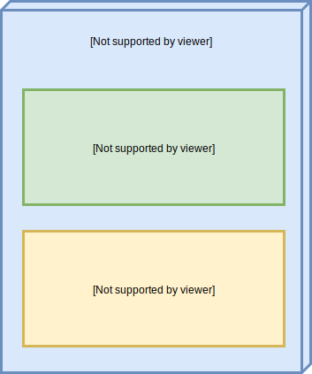
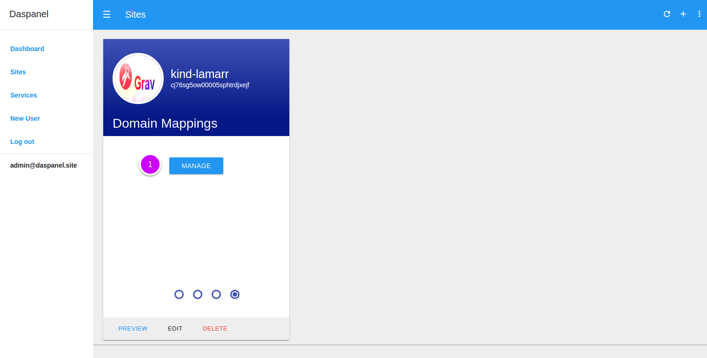
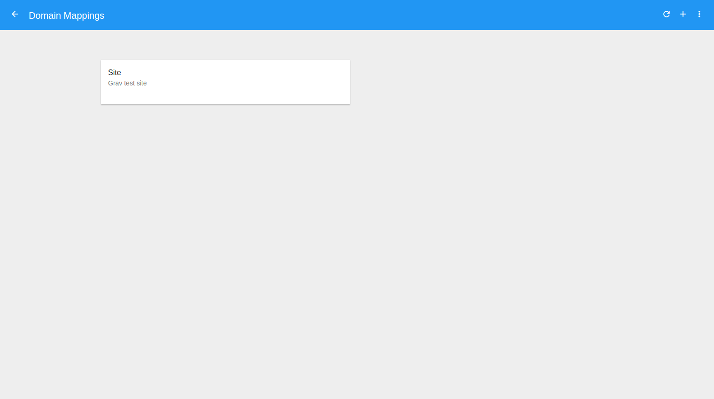

# Domain Mapping

As you may have noticed, every site and its versions are accessed through URL's 
such as: 

* `kind-lamarr.sites.daspanel.site`
* `https://cj76sg5ow00015sph8swly6p4.v.kind-lamarr.sites.daspanel.site`

These addresses are useful while developing a website, but obviously are not 
practical for sites in production. In order for you to associate a valid domain 
with the content of a site created in Daspanel there is the domain mapping feature.

This feature is also used to obtain a valid SSL certificate for the address used 
to access the site.

!!! warning ""
    Valid SSL certificates can only be obtained for valid domains and with 
    Daspanel running on a public IP address available on the internet. SSL 
    certificates can not be obtained for the domain `daspanel.site` because any 
    address associated with it will always have as IP address **127.0.0.1**.

    If you are running Daspanel locally, ie accessing it using the 
    `daspanel.site` domain, the SSL certificates will always be of the self 
    signed type, regardless of the type selected for the domain mapping.

See the diagram below for how it works:

In the drawing above is an example of a website that has 2 domain mappings and each 
one uses a different version.

So when you access the URL of the site `www.example.com` the 
content that will be displayed is what is stored in the **Initial version** 
version.

!!! tip ""
    When you map `www.example.com` to a site, Daspanel will automatically also 
    map `example.com` to the same site.

If you want to use this feature when Daspanel is running on your local computer, 
for tests, for example, be sure to add the following entries in the `hosts` file 
of your operating system:

| Host | Ip Address
| :--- | :---
| **example.com** | 127.0.0.1 |
| **www.example.com** | 127.0.0.1 |
| **dev.example.com** | 127.0.0.1 |

## Manage domain mapping

To see the available domain mappings of a site go to the [Sites module](http://admin.daspanel.site/sites/)

1. Click the **fourth bullet** to display the domain mapping management area of 
the chosen site.

The site card will be changed to the domain mapping management management area:

1. Click the **MANAGE** buttom to go the management page.

On the next page you will see a list of all the existing domain mappings for the site:

## Next steps

* [Add domain mapping](/help/sites/domain_mapping/add)
* [Edit domain mapping](/help/sites/versions/edit)
* [Delete domain mapping](/help/sites/versions/delete)
* [Preview domain mapping](/help/sites/versions/preview)

