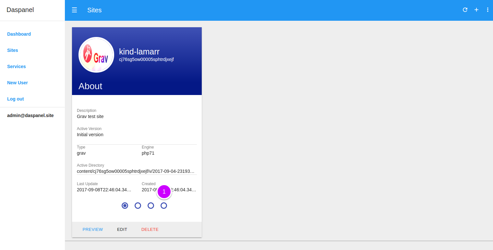

# Preview Domain Mapping

To see the available domain mappings of a site go to the [Sites module](http://admin.daspanel.site/sites/)

1. Click the **fourth bullet** to display the domain mapping management area of 
the chosen site.

The site card will be changed to the domain mapping management management area:

1. Click the **MANAGE** buttom to go the management page.

On the next page you will see a list of all the existing domain mappings for the site:

1. Click the "**Preview**" link.

You'll see the site preview on another browser window like this:

Of course, you can open a new window in your browser and directly enter the 
address of the mapping, in this example: [https://www.daspanel.site](https://www.daspanel.site)
