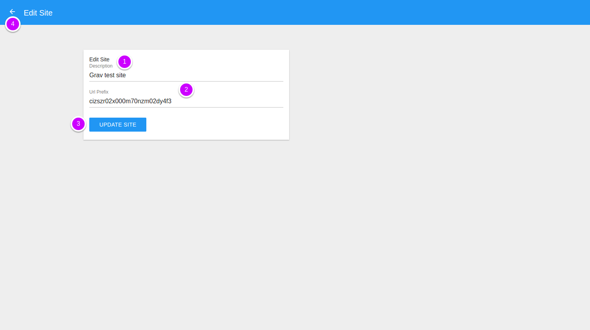

# Site edit

Go to the [Sites module](http://admin.daspanel.site/sites/)

1. Click the "EDIT" button of the site you want edit.

You'll see a new page to edit the site:

1. **Description**: Write an description for the site
2. **Url Prefix**: Any name that will be used to form the site access URL, e.x: test1

    !!! note ""
        For each site created in Daspanel is automatically assigned a unique URL that 
        allows the display of the content of it in your browser. Here is an example:

        `http://cizszr02x000m70nzm02dy4f3.sites.daspanel.site`

        * The *cizszr02x000m70nzm02dy4f3* segment of the URL matches the unique ID automatically 
        assigned to the site when it was created.
    
        * And *daspanel.site* is the name of the host where the control panel is running. 
        This name is usually set using the DASPANEL_HOST variable that you configured in the `daspanel.env` file.

        If you change the Url Prefix field to *test1*, for example, the site can be 
        accessed both by the primary as well as by using the custom address as follows:

        `http://cizszr02x000m70nzm02dy4f3.sites.daspanel.site` 

        `http://test1.sites.daspanel.site`

        *Only letters and numbers are allowed in this field.*

        *The chosen name must be unique, it cannot be in use by another site.*

3. Save the changes by clicking the **UPDATE SITE** button.
4. Or click the **left arrow**  at the top of 
the screen to return without saving anything.

When you change a site, Daspanel automatically notifies the HTTP server and 
Load Balancer containers to update with the new information.
