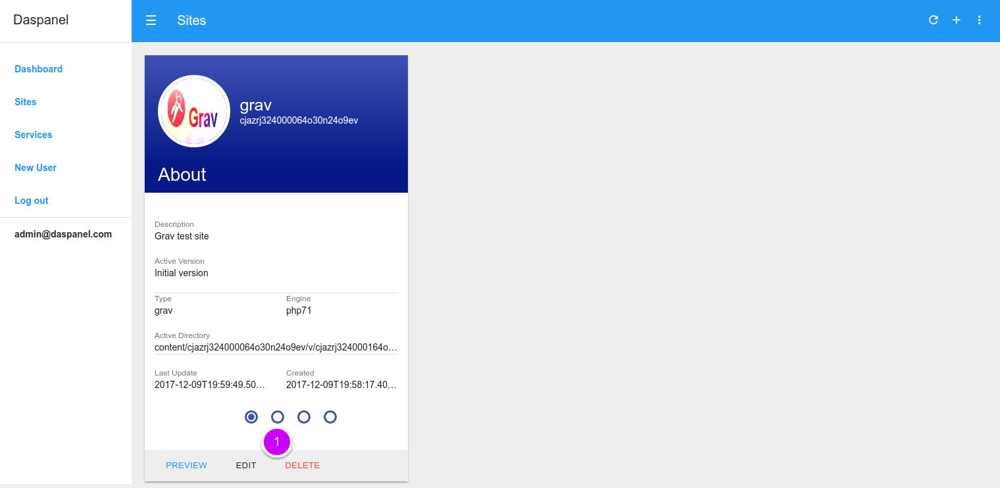
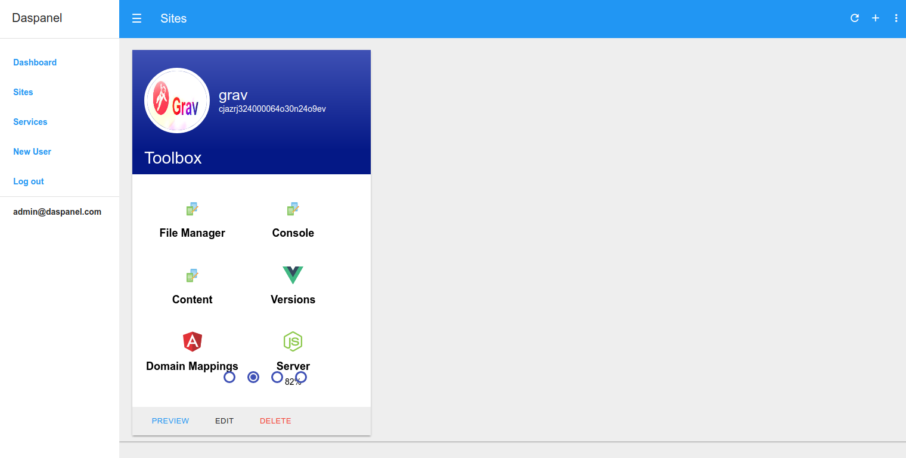

# Toolbox

Here are the links to various tools related to the selected site. Some of these 
can also be found in other parts of the Daspanel interface, others only here.

To see the available toolbox of a site go to the <b><a href="http://admin.daspanel.site/sites/" target="_blank">Sites module</a></b>

1. Click the **second bullet** to display the toolbox management area of the chosen site.

The site card will be changed to the toolbox management area:

Click on the tool icon to access it. The tools currently available are:

| Tool    | Purpose | Doc
| :------- | :------ | :------
| **File Manager** | Web file manager, with file editor and other features. | [Link](/help/services/filemanager)
| **Console** | Access to linux console (default version) through the browser. It allows to execute programs like PHP composer, NPM, Gulp, Bower, etc. | [Link](/help/sites/console)
| **Content** | Installs content on the site (default version) using ZIP file available on the internet. | [Link](/help/sites/add/#install-content)
| **Versions** | Manage site versions. | [Link](/help/sites/versions/overview)
| **Domain Mappings** | Manage site domain mappings. | [Link](/help/sites/domain_mapping/overview)
| **Server** | Commands related to Daspanel engines. |

## Next steps

* [Manage Versions](/help/sites/versions/overview)
* [Manage Domain Mappings](/help/sites/domain_mapping/overview)

