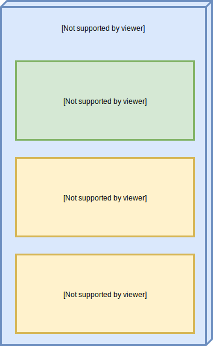
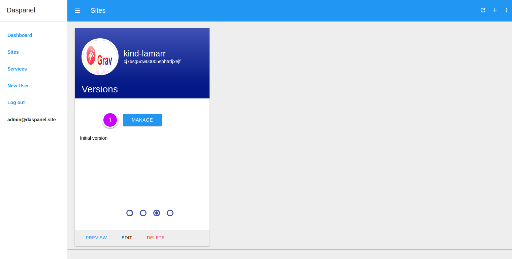
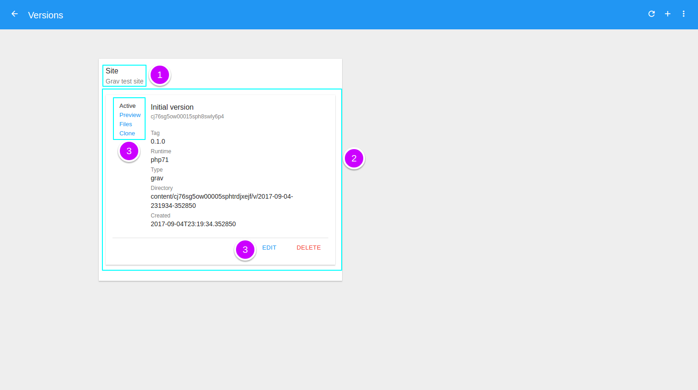

# Versions

Each site created in Daspanel has one or more versions and one of them will 
always be the active version, that is, the one whose content will be displayed 
when accessing the URL of the site.

See the diagram below for how it works:

In the drawing above is an example of a website that has 3 versions and each 
one uses a different engine as well as the type of the site is different.

So when you access the URL of the site `kind-lamarr.sites.daspanel.site` the 
content that will be displayed is what is stored in the **Initial version** 
version, which is the active version of the site.

The versions feature is very useful for:

* Implement and test new features on a site without affecting the active version of it.
* Test the operation of the website on a different type of engine. For example: 
the active site is made in Wordpress with PHP 5.6 and wants to know if it will 
work with PHP 7.1.
* Develop a new version of the site using a totally different engine or application type.

When a new site is created it will always have a first default version called "**Initial version**".

## Managing Versions

To see the available versions of a site go to the [Sites module](http://admin.daspanel.site/sites/)

1. Click the **third bullet** to display the version management area of the chosen site.

The site card will be changed to the version management area:

1. Click the **MANAGE** buttom to go the management page.

On the next page you will see a list of all the existing versions for the site:

At where:

1. Summary information of the site to which the versions belong.
2. Card with version information. There will be one card for each version.
3. Information about whether the version is the active for the site and commands 
that can be run in the version.

## Next steps

* [Clone version](/help/sites/versions/clone)
* [Add version](/help/sites/versions/add)
* [Set Default version](/help/sites/versions/activate)
* [Edit version](/help/sites/versions/edit)
* [Delete version](/help/sites/versions/delete)
* [Preview version](/help/sites/versions/preview)

