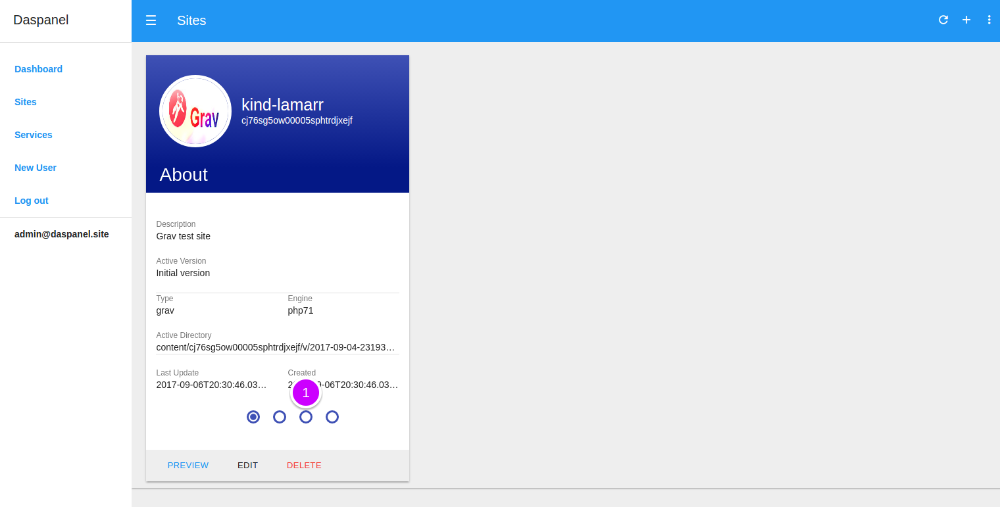
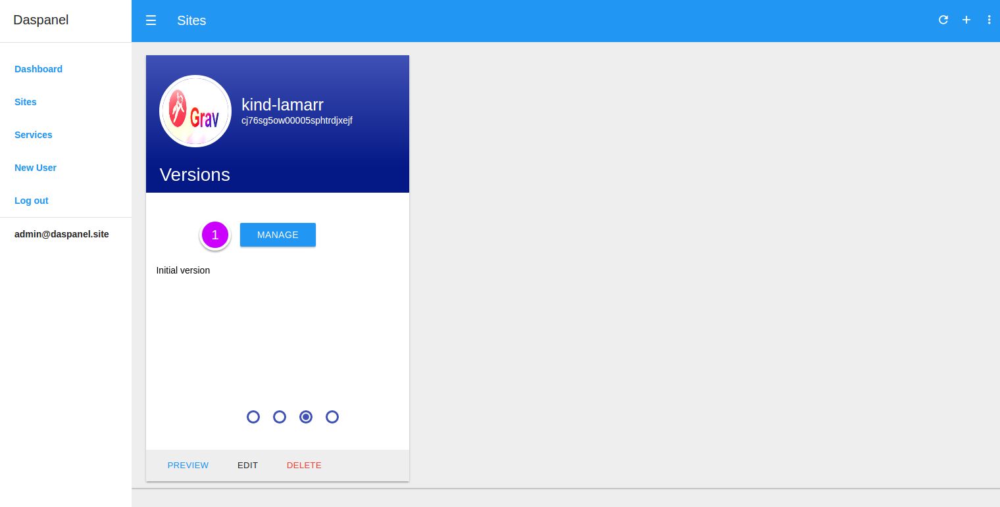
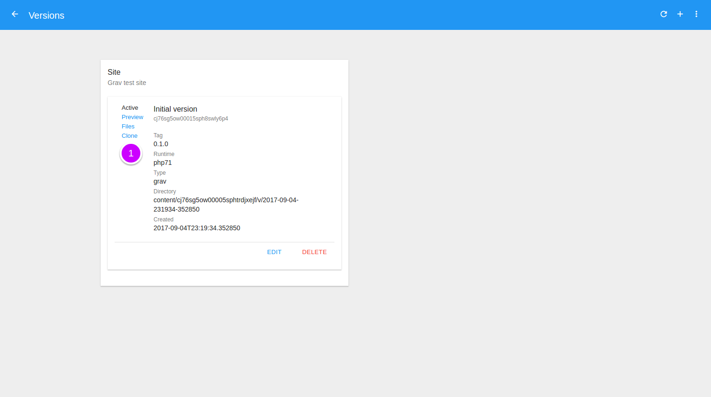
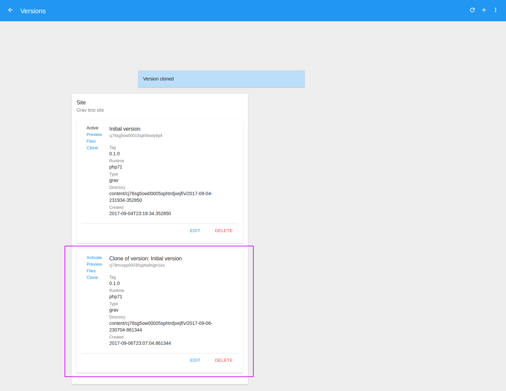

# Clone Version

To see the available versions of a site go to the [Sites module](http://admin.daspanel.site/sites/)

1. Click the **third bullet** to display the version management area of the chosen site.

The site card will be changed to the version management area:

1. Click the **MANAGE** buttom to go the management page.

On the next page you will see a list of all the existing versions for the site:

1. Click the **Clone** link to create a new version of the site by copying all 
files from the chosen version.

Once the operation is successfully completed the list of versions is updated:

Now with the new version that has been cloned you can:

* [Set Active version](/help/sites/versions/activate)
* [Edit version](/help/sites/versions/edit)
* [Delete version](/help/sites/versions/delete)
* [Preview version](/help/sites/versions/preview)

