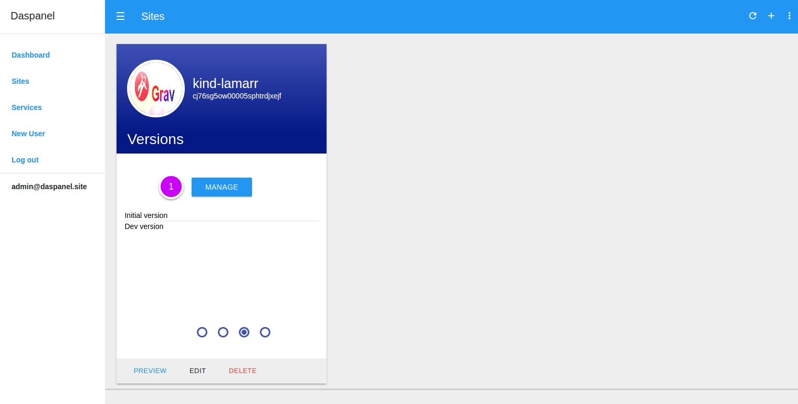
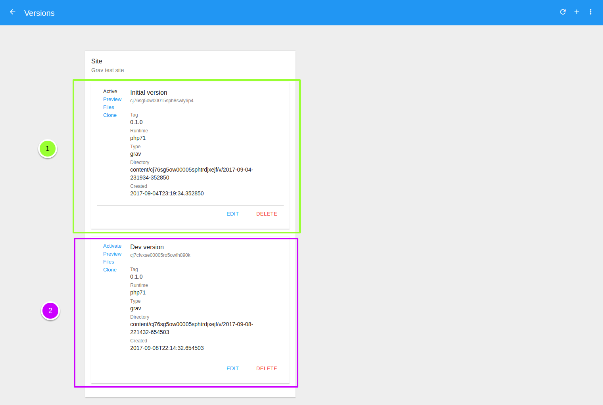
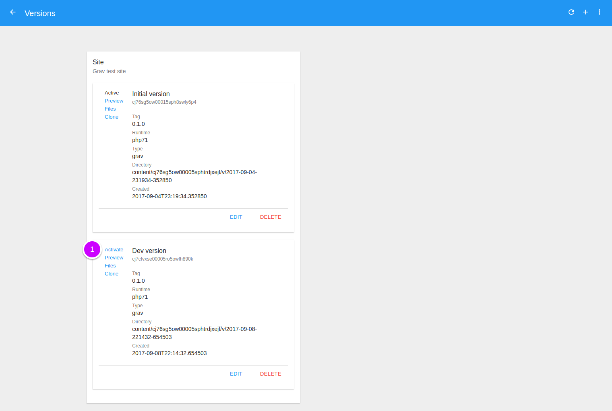
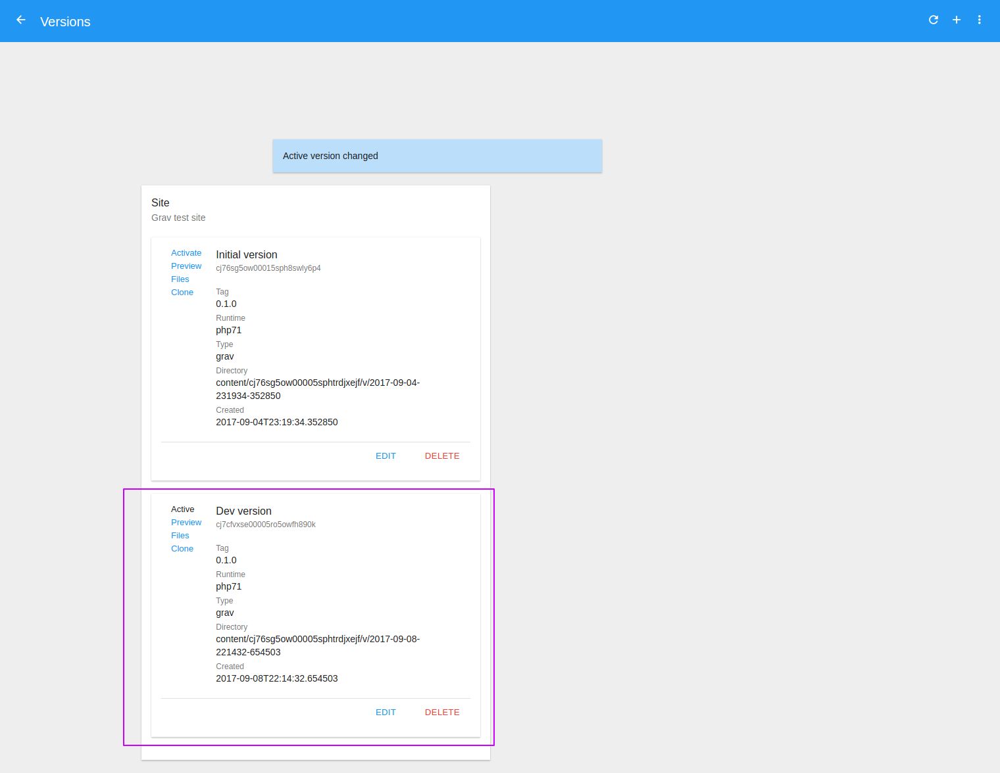

# Select Site Default Version

Because the site may have one or more versions you can choose which version is 
associated with the URL of the site, that is, the one that will appear when 
visiting the URL of the site.

So the URL of a website in Daspanel is something like 
`kind-lamarr.sites.daspanel.site` and when you visit it you will be seeing the 
contents of the active version of it.

Usually the version created automatically when a new site is added is the 
default version of it.

After creating additional versions you may want to change this behavior. Here's 
how to do it.

To see the available versions of a site go to the [Sites module](http://admin.daspanel.site/sites/)

1. Click the **third bullet** to display the version management area of the chosen site.

The site card will be changed to the version management area:

1. Click the **MANAGE** buttom to go the management page.

On the next page you will see a list of all the existing versions for the site:

1. This is the active version, or the default version associated with the site. 
You know this by the word **Active** just above the `Preview` link. And also because 
it is not a clickable link.
2. This is another version available for the site. It has a link called 
`Activate`.

To change the active version of the site that is **Initial version** to the other 
available version:

Now when you visit the xxxx URL you will see the contents of the DEV version, not the Initial version.

1. Click the **Activate** link to change the default version of the site.

And as a result, the default version of the site has been changed:

Now when you visit the `kind-lamarr.sites.daspanel.site` URL you will see the 
contents of the **Dev version**, not the **Initial version**.

