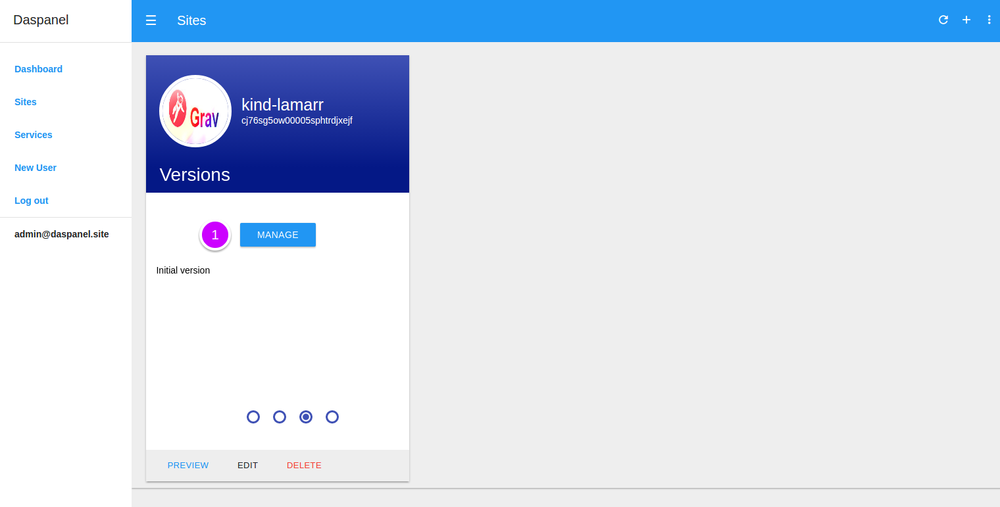

# Delete Version

To see the available versions of a site go to the [Sites module](http://admin.daspanel.site/sites/)

1. Click the **third bullet** to display the version management area of the chosen site.

The site card will be changed to the version management area:

1. Click the **MANAGE** buttom to go the management page.

On the next page you will see a list of all the existing versions for the site:

1. Click the "**DELETE**" button.

You'll see a new page to delete the choosen version for the site:

1. **You really want to delete this version ?**: Choose YES to confirm that the 
version can be deleted.
2. Delete the version by clicking the "**DELETE**" button.

    !!! danger ""
        This command has no return. When you confirm deletion of a version all of 
        its data in Daspanel will be deleted forever. No possibility of recovery.

3. Or click the **left arrow**  at the top of 
the screen to return without delete anything

Once the operation is successfully completed the list of versions is updated:

