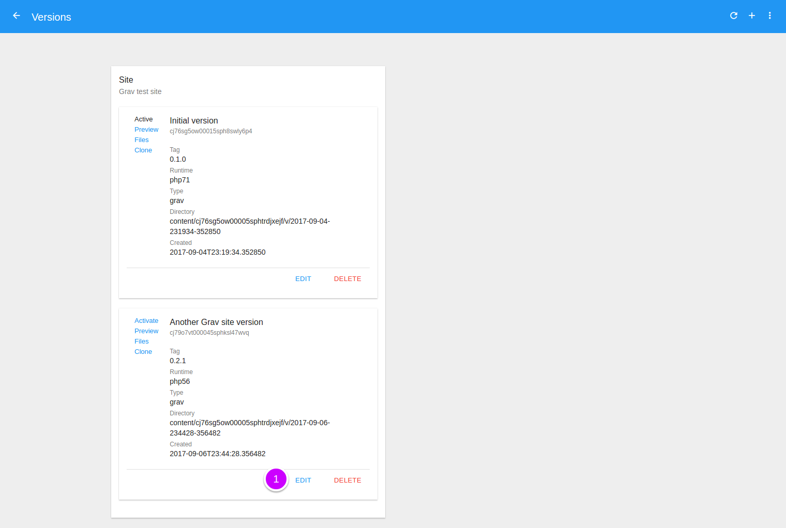
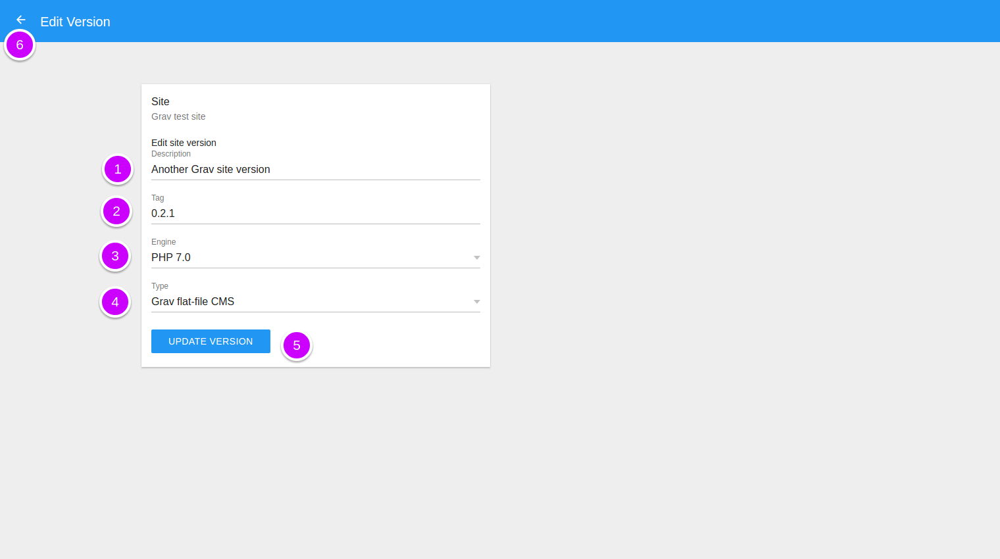
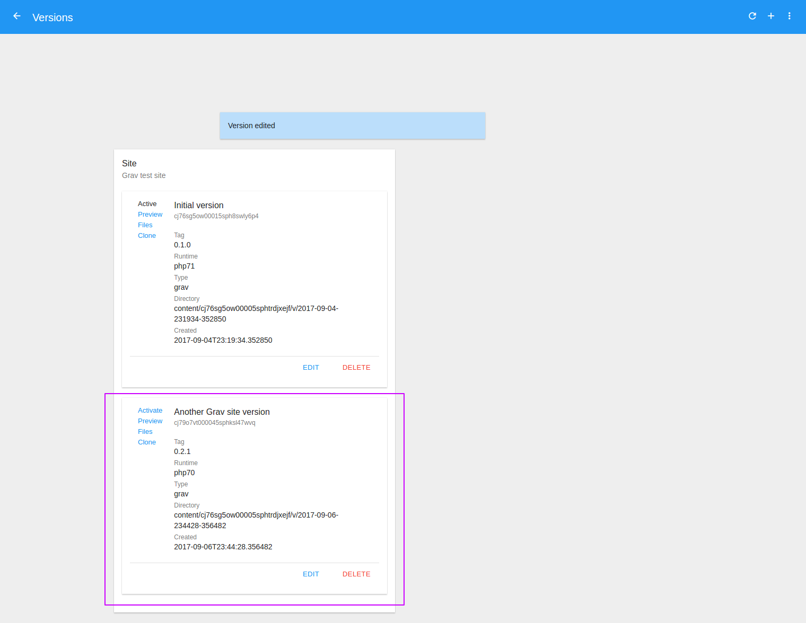

# Edit Version

To see the available versions of a site go to the [Sites module](http://admin.daspanel.site/sites/)

1. Click the **third bullet** to display the version management area of the chosen site.

The site card will be changed to the version management area:

1. Click the **MANAGE** buttom to go the management page.

On the next page you will see a list of all the existing versions for the site:

1. Click the "**Edit**" button.

You'll see a new page to edit the choosen version for the site:

1. **Description**: Write an description for the new version
2. **Tag**: Ignored for now. It will be used in the future.
3. **Engine**: Select the type of engine that will be used by this version

    !!! note ""
        The engine of the website is nothing more than the programming language 
        that is used to create it. If your site needs PHP choose the engine with 
        the most appropriate version. If the site is made only with HTML and 
        Javascript choose the option *Static*.

4. **Type**: Select the type of this version

    !!! note ""
        The options of this choice vary depending on the engine chosen for the 
        site in the previous option. All engines will have at least the 
        *Generic* option.

        If the engine of your site is not *Static* it is important to choose the 
        correct type because it is through this information that Daspanel will 
        properly configure the HTTP server for the site being created.

5. Create the new site version by clicking the **UPDATE VERSION** button.
6. Or click the **left arrow**  at the top of 
the screen to return without saving anything.

Once the operation is successfully completed the list of versions is updated:

Now with the new edited version you can:

* [Set Active version](/help/sites/versions/activate)
* [Delete version](/help/sites/versions/delete)
* [Preview version](/help/sites/versions/preview)

