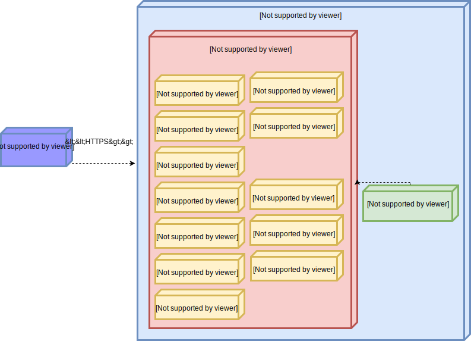

# How It Works

Daspanel can be defined as a set of Docker images (CONTAINERS) that work 
together through an orchestrator (docker-compose for now) and that have their 
settings defined through a REST API.

You can view the architecture in the image below:

The ultimate goal of it is to host one or more client sites, just like Cpanel 
or Plesk do.

## Docker Images

A set of Docker images are used for Daspanel to work. See below the purpose 
of each one:

| Image    | Function
| :------- | :------
| **PHP 5.6, PHP 7.0, PHP 7.1, Static HTML/JS** | Used to provide the hosting of each site created in Daspanel with the engine selected for them. In the future we think of offering other types of engines like Node, Rails, Python, etc. |
| **Proxy** | Entry point used when someone accesses a site hosted on Daspanel, it decides on which engine the site is hosted and forwards the request to it. In addition, it is responsible for obtaining the SSL security certificates for the sites. In the future it will also perform the load balancing service when Daspanel is ready for a clustered environment. |
| **API** | REST API server. It is the Daspanel kernel, through it all the typical operations of a hosting control panel are made. |
| **ControlPanel** | Web interface frontend to administer Daspanel using the API. |
| **Storage** | Compatible S3 server where the content of the sites are stored. |
| **MySql** | MySql server used for local development. |
| **Redis** | It is used by PHP engines as a session and cache data storage location and also by Daspanel to send messages to its various components through the Redis PubSub protocol. |
| **Services** | It offers a series of services that help in the development and maintenance of the sites. For example: Database administration (adminer) and file manager. |
| **MailCatcher** | Fake SMTP server that captures all emails sent from within Daspanel when a valid external server is not used. As for example, when sending an email from a PHP site using the `mail()` function without setting an external email sending server. |

## Data Storage

All data used in Daspanel, either by the sites hosted on it or by the system 
itself, are stored in a directory on the computer where it is running. Usually 
this data is inside a directory called `data` located in the same directory as 
the `docker-compose.yml` file used to start Daspanel.
