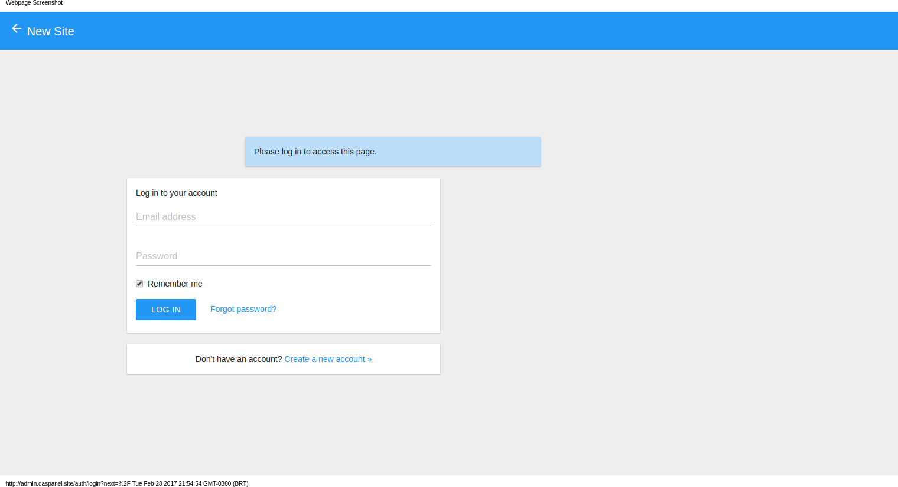
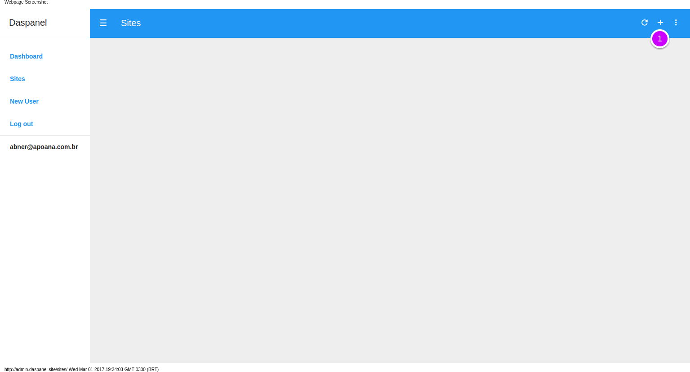

# Site using VUE-CLI

## Overview

Static websites made only with HTML and Javascript are a good option to have a 
presence on the internet. They are fast, safe and easy to maintain. And with the 
modern features of HTML, CSS and the many options available of javascript libraries 
and frameworks can be as rich of resources as the sites made using PHP, Rails, etc.

In this tutorial you will learn how to create an static site in Daspanel and 
download an initial template form Github.

## Quick Start

### Login

Open the admin in your browser [http://admin.daspanel.site](http://admin.daspanel.site)

The admin user and your password are the ones you choose when creating your 
project as instructed [here](/help/install/linux/#configure-daspanel).

### Create new site

Go to the [Sites module](http://admin.daspanel.site/sites/)

1. Add new site clicking the  
icone in the upper right of the Sites panel to see the page with the options for 
the new site:

1. Write an description for your new site
2. Choose 'Generic site' as Type
3. And 'Static' as Engine
4. Click on the button 'CREATE SITE'

### Install initial content

After the site has been created, a screen will be displayed to upload any remote 
content that is in a ZIP file. For this howto we will use a website template that is in Github.

1. To do the installation place this link 
[https://github.com/BlackrockDigital/startbootstrap-creative/archive/gh-pages.zip](https://github.com/BlackrockDigital/startbootstrap-creative/archive/gh-pages.zip) 
in the URL field.
2. Click the "UPLOAD CONTENT" button.

Because the site has been created now and the ZIP file with the content is 
publicly accessible, you only have to enter the URL where to get the file.

!!! tip "Template used"
    The content of the site was created using one of the cool themes of 
    [Start Bootstrap](https://startbootstrap.com). See the full list of their 
    themes by clicking [here](https://startbootstrap.com/template-categories/all/). 
    Most of them can be used for free.

### View the new site

Once the content of the new site has been installed you will see a page like this:

1. Click the "PREVIEW" button and a new window will open in your browser 
displaying the contents of the active version of the site.

Now just customize the site for your needs.

## Next Steps

* [Choose a friendly URL for the new site](/help/sites/edit.md)
* [Make custom changes to site files](/help/services/filemanager.md)

  <b><a href="http://docs.daspanel.com" target="_blank">Docs Home</a></b> 

