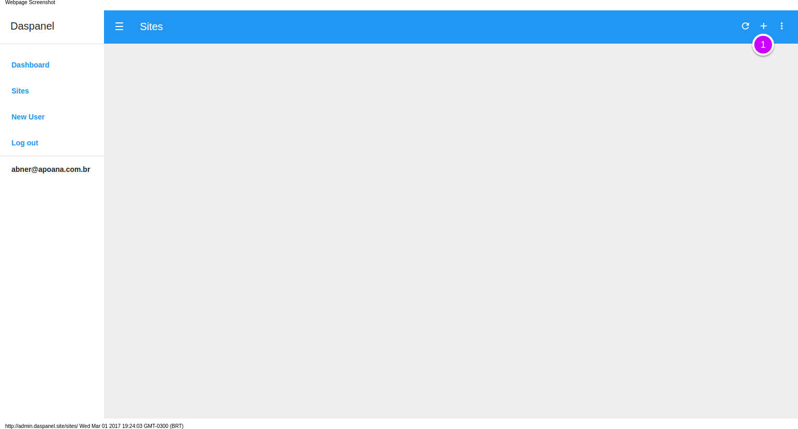
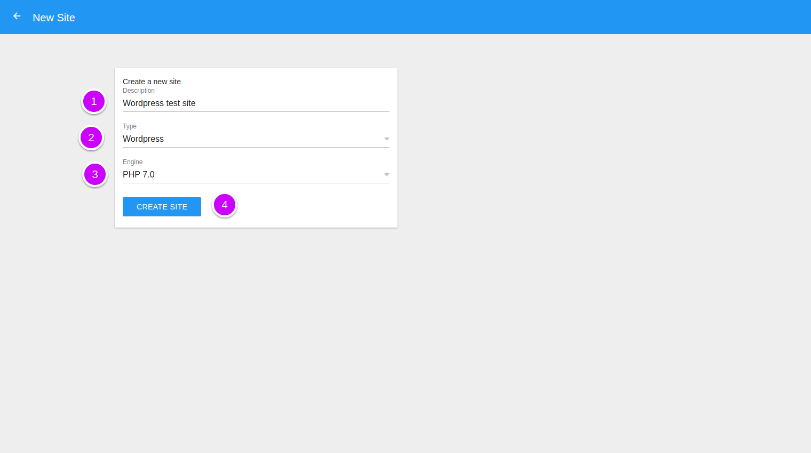
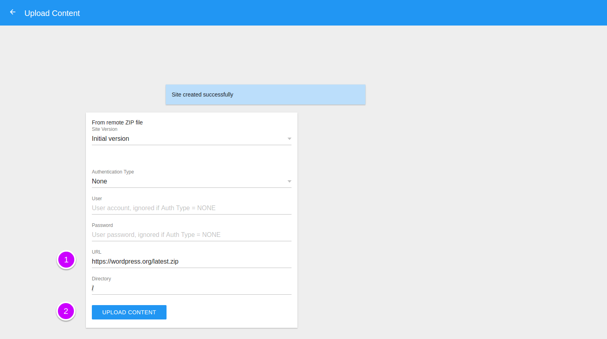
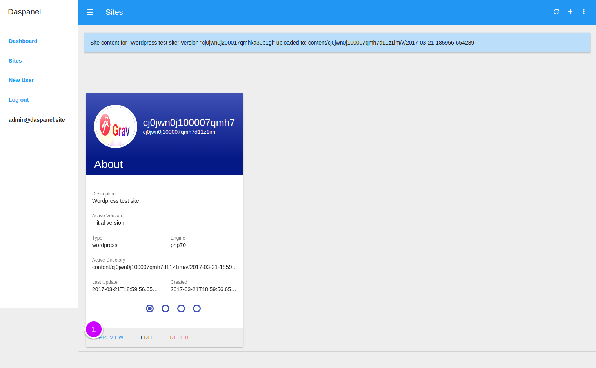
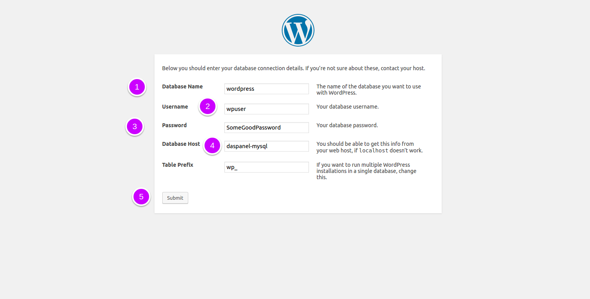

# Site using Wordpress

## Overview

Wordpress is the most used tool in the world for creating websites and blogs. 

In this tutorial you will learn how to create a Wordpress site in Daspanel.

## Quick Start

### Login

Open the admin in your browser [http://admin.daspanel.site](http://admin.daspanel.site)

The admin user and your password are the ones you choose when creating your 
project as instructed [here](/help/install/linux/#configure-daspanel).

### Create new site

Go to the [Sites module](http://admin.daspanel.site/sites/)

1. Add new site clicking the "+" icone in the upper right of the Sites panel to see the
page with the options for the new site:

1. **Description**: Write an description for your new site
2. **Type**: Choose 'Wordpress' as Type
3. **Engine**: And 'PHP 7.0' as Engine
4. Click on the button 'CREATE SITE'

### Install Wordpress

After the site has been created, a screen will be displayed to upload any remote 
content that is in a ZIP file.

1. **URL**: To do the installation place this link 
[https://wordpress.org/latest.zip](https://wordpress.org/latest.zip) 
in the URL field.
2. Click the "UPLOAD CONTENT" button.

Because the site has been created now and the ZIP file with the Wordpress is 
publicly accessible, you only have to enter the URL where to get the file.

!!! tip "Wordpress releases"
    At the time this document was written the last available version was at 4.7.3. 
    You can check the current version on the 
    [downloads page](https://wordpress.org/download/).

### View the new site

Once Wordpress is installed you will see a page like this:

1. Click the "PREVIEW" button and a new window will open in your browser 
displaying the contents of the active version of the site.

Now just complete the Wordpress setup in the new window that appears in your browser.

### Create Wordpress database

Before completing the Wordpress setup you need a MySQL database. Click the link 
below to find out how to use the Daspanel database management service:

[Database manager usage](/help/services/adminer.md)

### Finalize Wordpress setup

If you created a database called wordpress, with the user equal to **wpuser** and the 
password as **SomeGoodPassword** setup your Wordpress site database settings like this:

1. **Database Name**: The name of the database you created
2. **Username**: The database user name you created
3. **Password**: The password of the created database user
4. **Database Host**: Always equal *daspanel-mysql* if you are usind Daspanel MySQL container server
5. Click this button to continue Wordpress install

## Next Steps

* [Choose a friendly URL for the new site](/help/sites/edit.md)
* [Make custom changes to site files](/help/services/filemanager.md)

  <b><a href="http://docs.daspanel.com" target="_blank">Docs Home</a></b> 

