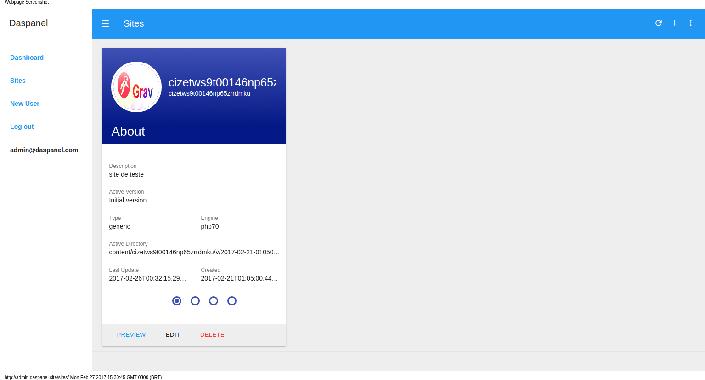
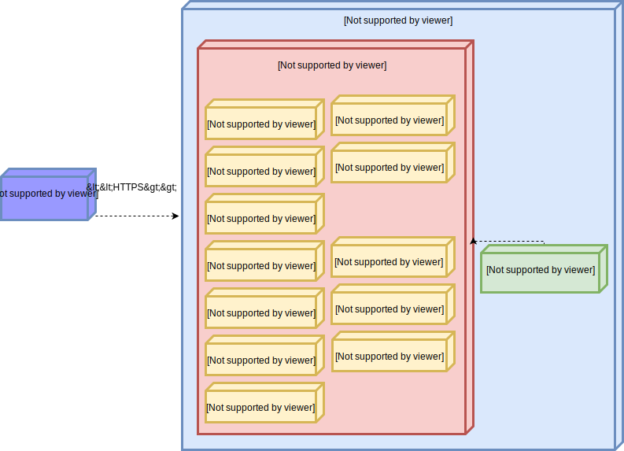

# Daspanel

Free, open-source, server agnostic, self-hosted web hosting control panel using Docker

* Free software: MIT license
* Project: https://github.com/daspanel/daspanel

## Features

* Use in your local computer or in any public server with same results.
* All services run using Docker containers on Linux, Windows or Mac hosts.
* [API First](https://dzone.com/articles/an-api-first-development-approach-1)
* Web interface that works on desktop browsers, smartphones and tablets.

For detailed list see the [features page][1].

  [1]: features.md

## Quick Start

### Requirements

Make sure you have installed the following software in your computer:

* docker
* docker-compose

### Install

Follow the appropriate instructions for your computer in one of the links below:

* [Linux](help/install/linux.md)
* [Windows](help/install/windows.md)
* [Mac](help/install/mac.md)

## Architecture

Daspanel can be defined as a set of Docker images (CONTAINERS) that work 
together through an orchestrator (docker-compose for now) and that have their 
settings defined through a REST API.

You can view the architecture in the image below:

The ultimate goal of it is to host one or more client sites, just like Cpanel 
or Plesk do.

To better understand his architecture see the content of [this page](howitworks.md).

## Why Daspanel ?

In a world dominated by cloud computing and the use of Docker containers, 
site hosting continues to be done mostly using tools like Cpanel or Plesk. 
Some of these tools were created in the 1990s (The Cpanel was created in 1996), 
and perhaps the time has come when they are no longer so relevant to the 
hosting business.

Website designers and hosting companies need tools more appropriate to the 
technology we have available today.

DASPANEL is a proposal for a new model of development and hosting of websites.
This is the first version of Daspanel. It is an exciting step forward towards 
making an hosting control panel using Docker. We created it so that you can 
create any site, plain or using PHP, in your local machine and when ready easy 
deploy it on an public server exactly as you see it in the development machine.

This software is still in a pre alpha stage but, stay tuned for interesting 
news soon.

Build something great!

## Open Source Credits

We use alot of open source software to make Daspanel. Although the list below 
is incomplete it contains the main projects used to create Daspanel:

* [Docker](https://www.docker.com/) - containerization platform
* [Alpine Linux](https://alpinelinux.org/) - Linux distro used in our docker 
images
* [S6 Overlay](https://github.com/just-containers/s6-overlay) - is a series of 
init scripts and utilities to ease creating Docker images using s6 as a process 
supervisor
* [Caddy](https://caddyserver.com/) - Fast, cross-platform HTTP/2 web server 
with automatic HTTPS
* [Connexion](https://github.com/zalando/connexion) - Swagger API framework for 
Python on top of Flask
* [Minio](https://minio.io/) - Open source object storage server compatible 
with Amazon S3 APIs
* And a lot more: [Flask](https://github.com/pallets/flask), 
[MariaDB](https://mariadb.org/), [PHP 5/7](http://php.net/), 
[TinyDB](https://github.com/msiemens/tinydb), 
[Muicss](https://www.muicss.com/), [CUID](https://github.com/ericelliott/cuid)	

